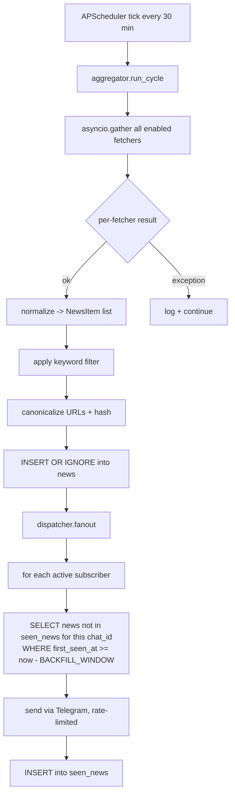
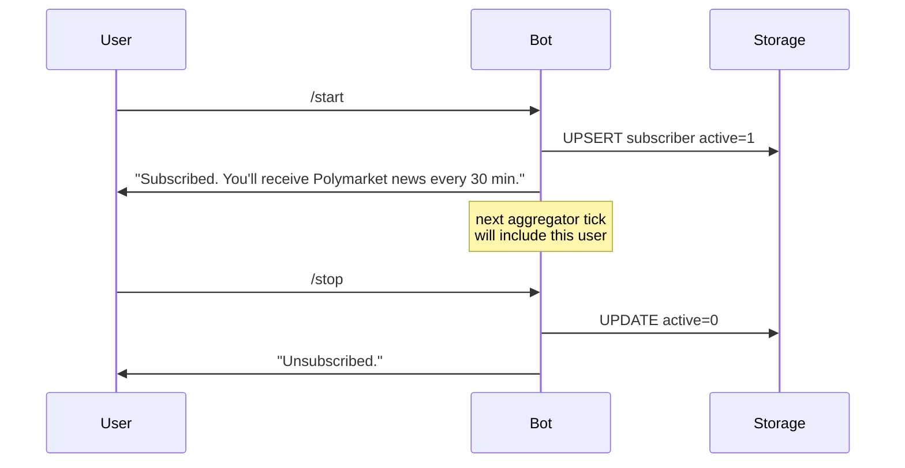
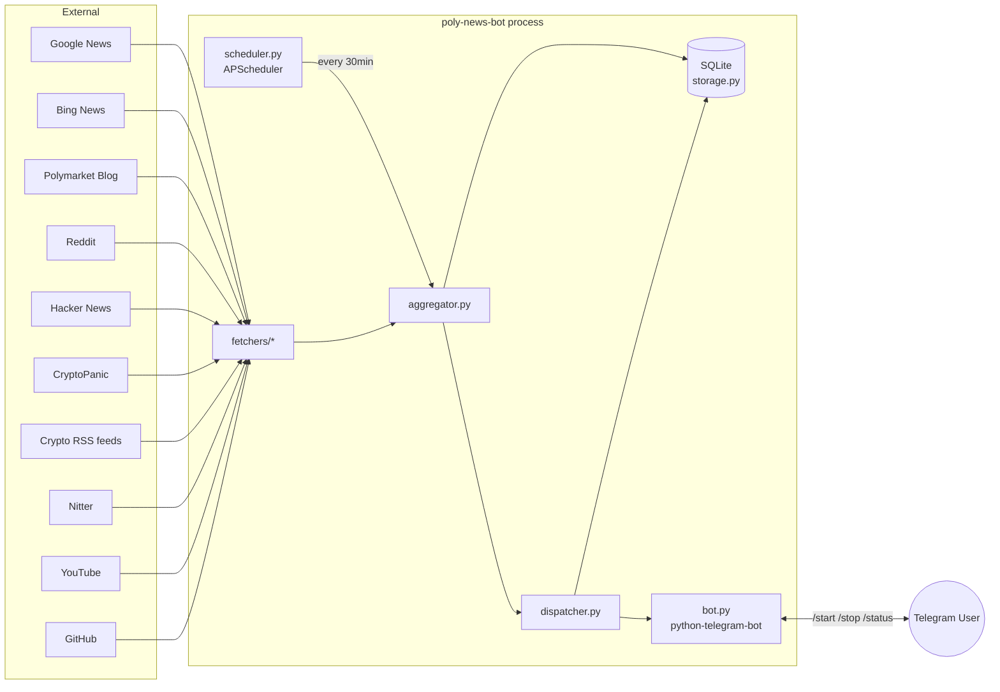
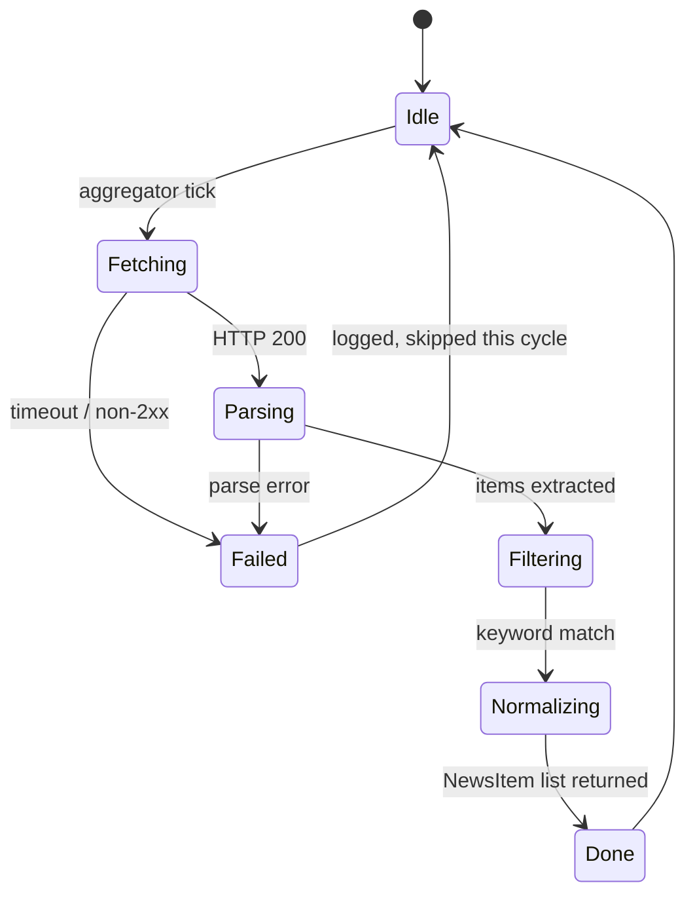

# Polymarket News Telegram Bot — Architecture & Design

## Overview

A Python-based Telegram bot that aggregates Polymarket-related news from a wide variety of public sources, deduplicates content per-subscriber, and pushes new items to each subscriber every 30 minutes. Users opt in with `/start` and opt out with `/stop`.

**Core stack:** `python-telegram-bot` v21+ (async), `APScheduler` (AsyncIOScheduler), `aiohttp` (HTTP), `feedparser` (RSS/Atom), `beautifulsoup4` (HTML fallback parsing), `aiosqlite` (storage), `python-dotenv` (config).

---

## 1. News Source Inventory

Goal: maximize coverage using **free, no-auth-required (or free-tier)** sources. All sources are filtered/normalized into a unified `NewsItem` stream and then deduplicated.

| # | Source | Type | URL / Endpoint | Auth | Rate Limit | Notes |
|---|--------|------|----------------|------|------------|-------|
| 1 | **Google News RSS** | RSS | `https://news.google.com/rss/search?q=Polymarket&hl=en-US&gl=US&ceid=US:en` | None | Generous (unofficial) | Best single source. Covers most mainstream outlets. Add variants for "prediction market polymarket", "polymarket election", etc. |
| 2 | **Bing News RSS** | RSS | `https://www.bing.com/news/search?q=Polymarket&format=rss` | None | Generous | Complements Google News with different ranking/coverage. |
| 3 | **Polymarket Official Blog** | RSS/HTML | `https://polymarket.com/blog` (verify feed URL — try `/rss`, `/feed`, `/blog/rss.xml`); fallback scrape | None | N/A | Authoritative source. If no RSS, scrape `<article>` links. |
| 4 | **Polymarket X/Twitter via Nitter** | RSS | `https://nitter.net/Polymarket/rss` (and mirrors: `nitter.poast.org`, `nitter.privacydev.net`) | None | Mirror-dependent; rotate mirrors | Free alternative to X API. Mirrors die frequently — keep a list and failover. |
| 5 | **X/Twitter Official API** | REST | `https://api.twitter.com/2/tweets/search/recent?query=polymarket` | Bearer token (paid tier now) | Free tier dropped — paid only | Listed for completeness; **disabled by default**. Enable only if user provides `TWITTER_BEARER_TOKEN`. |
| 6 | **Reddit r/polymarket** | JSON | `https://www.reddit.com/r/polymarket/new.json?limit=25` | None (UA required) | ~60 req/min unauth | Must set a unique `User-Agent`. |
| 7 | **Reddit search (cross-sub)** | JSON | `https://www.reddit.com/search.json?q=polymarket&sort=new&limit=25` | None | Same | Catches mentions in r/CryptoCurrency, r/PredictionMarkets, etc. |
| 8 | **Hacker News (Algolia)** | REST | `https://hn.algolia.com/api/v1/search_by_date?query=polymarket&tags=story` | None | Generous | Returns JSON with stories matching keyword. |
| 9 | **CryptoPanic** | REST | `https://cryptopanic.com/api/<plan>/v2/posts/?auth_token=KEY&public=true` + keyword filter "polymarket" | **PAID API key** (developer / growth / enterprise) | Plan-dependent | ⚠️ **Updated 2026-04-01:** Free Developer tier discontinued. Endpoint moved to `/api/<plan>/v2/posts/`. Now paid-only. Set both `CRYPTOPANIC_API_KEY` and `CRYPTOPANIC_API_PLAN`. |
| 9b | **NewsData.io** | REST | `https://newsdata.io/api/1/latest?apikey=KEY&q=polymarket&language=en` | Free API key | 200 req/day free | **Recommended free replacement for CryptoPanic.** Sign up: <https://newsdata.io/register>. |
| 9c | **Mediastack** | REST | `https://api.mediastack.com/v1/news?access_key=KEY&keywords=polymarket&languages=en&sort=published_desc` | Free API key | 100 req/month free (very low) | Secondary key-gated aggregator. Sign up: <https://mediastack.com/signup/free>. |
| 10 | **CoinDesk RSS** | RSS | `https://www.coindesk.com/arc/outboundfeeds/rss/` | None | None | Filter by `"polymarket"` (case-insensitive) in title/summary. |
| 11 | **CoinTelegraph RSS** | RSS | `https://cointelegraph.com/rss` | None | None | Same keyword filter. |
| 12 | **Decrypt RSS** | RSS | `https://decrypt.co/feed` | None | None | Same keyword filter. |
| 13 | **The Block RSS** | RSS | `https://www.theblock.co/rss.xml` | None | None | Same keyword filter. |
| 14 | **The Defiant RSS** | RSS | `https://thedefiant.io/api/feed` | None | None | Crypto/DeFi outlet. Keyword filter. |
| 15 | **Bankless RSS** | RSS | `https://newsletter.banklesshq.com/feed` | None | None | Keyword filter. |
| 16 | **Blockworks RSS** | RSS | `https://blockworks.co/feed` | None | None | Keyword filter. |
| 17 | **CoinJournal RSS** | RSS | `https://coinjournal.net/news/feed/` | None | None | Keyword filter. |
| 18 | **CryptoSlate RSS** | RSS | `https://cryptoslate.com/feed/` | None | None | Keyword filter. |
| 19 | **Protos RSS** | RSS | `https://protos.com/feed/` | None | None | Keyword filter. |
| 20 | **Messari news** | REST | `https://data.messari.io/api/v1/news?fields=title,url,published_at,tags` | None (free tier) | Limited | Filter by keyword/tag. |
| 21 | **YouTube channel RSS — Polymarket** | RSS | `https://www.youtube.com/feeds/videos.xml?channel_id=<UC...>` (resolve via `https://www.youtube.com/@Polymarket`) | None | None | Resolve channel ID once, hardcode in config. |
| 22 | **YouTube search RSS** | RSS | `https://www.youtube.com/feeds/videos.xml?search_query=polymarket` (note: this endpoint is unofficial; fallback: scrape `results?search_query=polymarket&sp=CAI%253D`) | None | Fragile | Optional; treat as best-effort. |
| 23 | **GitHub — Polymarket org events** | REST | `https://api.github.com/orgs/Polymarket/events/public` and `/repos/Polymarket/{repo}/releases` | None (60/hr) or PAT (5000/hr) | Per IP | Surface releases & notable commits as "dev news". |
| 24 | **Substack search** | RSS | `https://substack.com/search/polymarket?searching=true` (no RSS — scrape) or follow specific newsletters' `/feed` once discovered | None | None | Best-effort scrape; low priority. |
| 25 | **Medium tag feed** | RSS | `https://medium.com/feed/tag/polymarket` | None | None | Lightweight feed; often sparse but free. |
| 26 | **Mirror.xyz** | RSS | `https://mirror.xyz/polymarket.eth/feed/atom` (verify ENS) | None | None | If Polymarket publishes there. |
| 27 | **Paragraph.xyz / Farcaster** | Various | Farcaster Hub API or warpcast channel | None | None | Advanced; optional. |
| 28 | **DefiLlama news** | REST | `https://api.llama.fi/news` (if available) or scrape `https://defillama.com/news` | None | None | Keyword filter. |
| 29 | **Yahoo Finance news search** | RSS | `https://finance.yahoo.com/rss/headline?s=polymarket` (best-effort) | None | None | Often empty but cheap to poll. |
| 30 | **PRNewswire / BusinessWire keyword** | RSS | `https://www.prnewswire.com/rss/news-releases-list.rss` + keyword filter | None | None | Catches official press releases. |

### Source classification

- **Direct (always-on, no filter):** #1, #2, #3, #4, #6, #7, #8, #21, #23 — these are already Polymarket-scoped or the bot uses a Polymarket query.
- **Filtered (poll feed, keep items mentioning "polymarket"):** #10–#20, #25, #26, #28, #29, #30.
- **Optional (require API key or are paid):** #5 (Twitter API — paid), #9 (CryptoPanic — **paid only since 2026-04-01**), #9b (NewsData.io — free key), #9c (Mediastack — free key, low quota).
- **Best-effort / fragile:** #22, #24, #27 — implemented behind a feature flag.

### Keyword filter rules

Case-insensitive substring match on `title + summary + tags` for any of:
`"polymarket"`, `"poly market"`, `"$poly"` (only if disambiguated), `"prediction market"` (gated — too broad alone; require co-occurrence with "polymarket" or specific market names).

---

## 2. Project File Structure

```
poly-news-bot/
├── bot.py                    # Entry point; Telegram Application setup & command handlers
├── scheduler.py              # APScheduler AsyncIOScheduler config & job registration
├── config.py                 # Env var loading via python-dotenv; typed Settings dataclass
├── storage.py                # aiosqlite wrapper: subscribers + seen_news tables
├── aggregator.py             # Orchestrates all fetchers; runs the 30-min poll cycle
├── dispatcher.py             # Per-subscriber filtering + Telegram message sending
├── fetchers/
│   ├── __init__.py           # Registry of enabled fetchers
│   ├── base.py               # NewsItem dataclass + BaseFetcher abstract class
│   ├── google_news.py        # Source #1
│   ├── bing_news.py          # Source #2
│   ├── polymarket_blog.py    # Source #3
│   ├── nitter.py             # Source #4 (Twitter/X via Nitter)
│   ├── twitter_api.py        # Source #5 (optional, behind flag)
│   ├── reddit.py             # Sources #6, #7
│   ├── hacker_news.py        # Source #8
│   ├── cryptopanic.py        # Source #9 (optional)
│   ├── rss_generic.py        # Reusable filtered-RSS fetcher (Sources #10–#20, #25, #26, #29, #30)
│   ├── messari.py            # Source #20
│   ├── youtube.py            # Sources #21, #22
│   ├── github.py             # Source #23
│   └── substack.py           # Source #24 (optional)
├── utils/
│   ├── __init__.py
│   ├── hashing.py            # Stable URL canonicalization + SHA256
│   ├── keyword_filter.py     # "polymarket" matcher
│   ├── http.py               # Shared aiohttp ClientSession + retry helper
│   └── formatter.py          # NewsItem -> Telegram HTML/Markdown message
├── data/
│   └── bot.db                # SQLite database (gitignored)
├── tests/
│   ├── test_hashing.py
│   ├── test_keyword_filter.py
│   └── test_fetchers.py
├── requirements.txt
├── .env.example
├── .gitignore
├── README.md
└── ARCHITECTURE.md           # this file
```

### Module responsibilities

- [`bot.py`](bot.py): Wires up `python-telegram-bot` `Application`, registers handlers, starts polling/webhook, hands the `Application` to `scheduler.py`.
- [`scheduler.py`](scheduler.py): Creates `AsyncIOScheduler`, schedules `aggregator.run_cycle()` every `POLL_INTERVAL_MINUTES`, plus a one-shot run on startup (after a short delay).
- [`aggregator.py`](aggregator.py): Loads enabled fetchers, runs them via `asyncio.gather(..., return_exceptions=True)`, normalizes results, persists `NewsItem`s, then calls `dispatcher.fanout()`.
- [`dispatcher.py`](dispatcher.py): For each active subscriber, queries `seen_news` to find items not yet sent, sends them via Telegram with rate-limit-friendly pacing (sleep 50ms between sends, batch by chat).
- [`storage.py`](storage.py): Async CRUD for subscribers and seen_news; transactional inserts.
- [`fetchers/base.py`](fetchers/base.py): Defines `NewsItem` and `BaseFetcher.fetch() -> list[NewsItem]`; every concrete fetcher subclasses it.

---

## 3. Data Model

### `NewsItem` dataclass

```text
NewsItem
├── id:           str        # SHA256 hex of canonical URL (see §4)
├── title:        str        # cleaned, max 300 chars
├── url:          str        # canonical URL (post-redirect, query-stripped for trackers)
├── source:       str        # short slug, e.g. "google_news", "reddit", "polymarket_blog"
├── source_label: str        # human-readable, e.g. "Google News", "r/polymarket"
├── published_at: datetime   # UTC; falls back to fetch time if missing
├── summary:      str | None # 0–500 chars; stripped of HTML
└── author:       str | None # optional (Reddit user, tweet author, etc.)
```

### SQLite schema

```sql
-- Subscribers
CREATE TABLE IF NOT EXISTS subscribers (
    chat_id     INTEGER PRIMARY KEY,
    username    TEXT,
    joined_at   TIMESTAMP NOT NULL DEFAULT CURRENT_TIMESTAMP,
    active      INTEGER NOT NULL DEFAULT 1,
    stopped_at  TIMESTAMP
);

-- News catalog (global; one row per unique news item ever seen)
CREATE TABLE IF NOT EXISTS news (
    news_hash     TEXT PRIMARY KEY,         -- = NewsItem.id
    title         TEXT NOT NULL,
    url           TEXT NOT NULL,
    source        TEXT NOT NULL,
    source_label  TEXT NOT NULL,
    published_at  TIMESTAMP NOT NULL,
    summary       TEXT,
    author        TEXT,
    first_seen_at TIMESTAMP NOT NULL DEFAULT CURRENT_TIMESTAMP
);
CREATE INDEX IF NOT EXISTS idx_news_first_seen ON news(first_seen_at);
CREATE INDEX IF NOT EXISTS idx_news_source ON news(source);

-- Per-user delivery log (composite PK = per-user dedup)
CREATE TABLE IF NOT EXISTS seen_news (
    news_hash  TEXT NOT NULL,
    chat_id    INTEGER NOT NULL,
    sent_at    TIMESTAMP NOT NULL DEFAULT CURRENT_TIMESTAMP,
    PRIMARY KEY (news_hash, chat_id),
    FOREIGN KEY (news_hash) REFERENCES news(news_hash),
    FOREIGN KEY (chat_id)   REFERENCES subscribers(chat_id)
);
CREATE INDEX IF NOT EXISTS idx_seen_chat ON seen_news(chat_id);
```

### Why this schema (hybrid approach)

We use **both** a global `news` catalog AND a per-user `seen_news` log. Rationale:

- The global `news` table lets us avoid storing duplicate metadata per user and supports analytics/`/status` queries cheaply.
- `seen_news(news_hash, chat_id)` composite PK enables exact **per-user deduplication** — critical because:
  - A user who subscribes today must receive items seen-globally-yesterday only if they're still fresh (we apply a backfill cap, see §5).
  - A user who has already received item X must never receive it again, even after bot restarts.
- Pruning: a daily job deletes `news` rows older than 30 days (and cascading `seen_news` rows), keeping the DB compact.

---

## 4. Deduplication Strategy

### Hashing

```text
news_hash = SHA256( canonicalize(url) ).hexdigest()
```

**`canonicalize(url)` rules:**
1. Lowercase scheme + host.
2. Strip fragment (`#...`).
3. Strip known tracking query params: `utm_*`, `ref`, `ref_src`, `fbclid`, `gclid`, `mc_cid`, `mc_eid`, `igshid`, `_hsenc`, `_hsmi`.
4. Sort remaining query params alphabetically.
5. Resolve Google News redirect URLs (`news.google.com/articles/...`) to the underlying article URL — issue a `HEAD` (follow redirects) once, cache the resolution. If resolution fails, fall back to hashing the Google News URL.
6. Strip trailing `/`.

**Why URL-based, not title-based:**
- Same article reposted across many feeds shares the URL after resolution → collapses cross-source duplicates (Google News + CoinDesk RSS + CryptoPanic all pointing to the same CoinDesk article all hash to the same ID — one delivery).
- Titles vary (publishers edit them; aggregators rewrite them) so title-hashing causes false uniques.
- Two distinct articles never share a URL.

**Secondary fallback hash (when no URL is meaningful, e.g. a tweet without permalink):**
`SHA256(source + "|" + author + "|" + title + "|" + published_at.date())` — used only by sources that lack stable URLs.

### Insert flow

```text
for item in fetched_items:
    INSERT OR IGNORE INTO news(news_hash, ...) VALUES (...)
    # If IGNORE fired -> item already known globally, but may still be unsent for some users.
```

Dedup is therefore **idempotent across fetcher overlap** (an article surfacing in 5 feeds is stored once).

---

## 5. Scheduling Flow

### High-level



### Pseudocode

```text
async def run_cycle():
    fetchers = registry.enabled()
    results = await asyncio.gather(
        *(f.safe_fetch() for f in fetchers),  # safe_fetch wraps fetch() in try/except + timeout
        return_exceptions=False                # exceptions already swallowed inside safe_fetch
    )
    items: list[NewsItem] = []
    for fetcher, result in zip(fetchers, results):
        if isinstance(result, FetcherError):
            log.warning("fetcher %s failed: %s", fetcher.name, result)
            continue
        items.extend(result)

    items = [i for i in items if keyword_filter.matches(i)]
    items = dedupe_in_batch(items)  # by news_hash, within this cycle
    new_count = await storage.bulk_upsert_news(items)
    log.info("cycle fetched=%d new_global=%d", len(items), new_count)

    await dispatcher.fanout(items)


async def dispatcher.fanout(items):
    subscribers = await storage.active_subscribers()
    cutoff = now_utc() - BACKFILL_WINDOW  # e.g. 24h, applies only to brand-new subscribers
    for chat_id in subscribers:
        unsent = await storage.unsent_for(chat_id, cutoff)
        # Cap per-cycle to avoid flooding (e.g. first cycle for a new subscriber)
        unsent = unsent[:MAX_ITEMS_PER_CYCLE]   # e.g. 10
        for item in unsent:
            try:
                await telegram.send(chat_id, format(item))
                await storage.mark_sent(item.news_hash, chat_id)
                await asyncio.sleep(0.05)        # ~20 msgs/sec, well under Telegram limits
            except Forbidden:                    # user blocked the bot
                await storage.deactivate(chat_id)
                break
            except RetryAfter as e:
                await asyncio.sleep(e.retry_after)
```

### Error isolation guarantees

- Each fetcher has a **per-call timeout** (default 20s) and is wrapped in `safe_fetch`, which catches all `Exception`s and returns a `FetcherError` sentinel.
- A failing fetcher logs at WARNING and is excluded from this cycle; it is retried on the next tick.
- Per-message send failures do not abort the cycle for other users.
- DB operations use short transactions (one per subscriber's fanout batch) so partial cycles are durable.

### Startup backfill behavior

- On a brand-new subscriber's first delivery cycle, only items with `first_seen_at >= now - BACKFILL_WINDOW` (default **24 hours**) are eligible. This prevents dumping months of history on new users.
- On bot restart, the catch-up cycle runs ~30s after boot, then resumes the 30-min schedule.

---

## 6. Bot Commands

| Command | Handler | Behavior |
|---|---|---|
| `/start` | `cmd_start` | Insert/reactivate subscriber. Reply: welcome message, mention next poll time, link to `/help`. |
| `/stop` | `cmd_stop` | Set `subscribers.active=0`, `stopped_at=now`. Reply: confirmation; explain `/start` to resubscribe. |
| `/status` | `cmd_status` | Show: subscription state, joined date, number of items delivered to this chat, next scheduled poll, total active subscribers (optional). |
| `/sources` | `cmd_sources` | List enabled sources with short descriptions, paginated if needed. Read from fetcher registry. |
| `/help` | `cmd_help` | List all commands and a brief overview of how the bot works. |
| `/last [N]` | `cmd_last` *(optional bonus)* | Resend the last N (default 5, max 20) items delivered to this user — useful if Telegram was offline. |
| `/ping` | `cmd_ping` | Health check; reply "pong" + uptime. *(Hidden; useful for ops.)* |

### Handler matrix



---

## 7. Configuration / Environment Variables

`.env.example`:

```dotenv
# ===== Required =====
TELEGRAM_BOT_TOKEN=123456:ABC-DEF...           # from @BotFather

# ===== Polling =====
POLL_INTERVAL_MINUTES=30                       # default 30
STARTUP_DELAY_SECONDS=30                       # before first cycle on boot
BACKFILL_WINDOW_HOURS=24                       # new-subscriber lookback
MAX_ITEMS_PER_CYCLE=10                         # cap per user per tick

# ===== Storage =====
DATABASE_PATH=./data/bot.db
NEWS_RETENTION_DAYS=30                         # pruning job threshold

# ===== HTTP =====
HTTP_TIMEOUT_SECONDS=20
HTTP_USER_AGENT=PolyNewsBot/1.0 (+https://t.me/your_bot)

# ===== Optional source credentials =====
CRYPTOPANIC_API_KEY=                           # leave blank to disable source #9
TWITTER_BEARER_TOKEN=                          # leave blank to disable source #5
GITHUB_TOKEN=                                  # optional; raises rate limit on source #23

# ===== Source toggles (comma-separated slugs to disable) =====
DISABLED_SOURCES=                              # e.g. "substack,medium"

# ===== Nitter mirrors (failover list, comma-separated) =====
NITTER_MIRRORS=nitter.net,nitter.poast.org,nitter.privacydev.net

# ===== Logging =====
LOG_LEVEL=INFO
```

### Settings loading

`config.py` exposes a typed `Settings` dataclass loaded from `.env` via `python-dotenv`. All fetchers receive their relevant config slice; missing optional keys silently disable the corresponding source (logged at INFO once on startup).

---

## 8. Dependencies

### `requirements.txt`

```text
python-telegram-bot[job-queue]==21.6
APScheduler==3.10.4
aiohttp==3.10.10
aiosqlite==0.20.0
feedparser==6.0.11
beautifulsoup4==4.12.3
lxml==5.3.0
python-dotenv==1.0.1
tenacity==9.0.0
python-dateutil==2.9.0.post0
```

### Rationale per package

- **`python-telegram-bot[job-queue]` v21+** — modern async API; required for `asyncio` integration with APScheduler.
- **`APScheduler`** — explicit per-task requirement; `AsyncIOScheduler` plays nicely with PTB's event loop.
- **`aiohttp`** — async HTTP for all fetchers, shared connection pool.
- **`aiosqlite`** — async SQLite (avoids blocking the event loop on DB I/O).
- **`feedparser`** — battle-tested RSS/Atom parser; handles the 20+ feed sources uniformly.
- **`beautifulsoup4` + `lxml`** — HTML fallback parsing (Polymarket blog if no RSS, Substack search, YouTube scraping).
- **`python-dotenv`** — env var loading.
- **`tenacity`** — retries with exponential backoff for transient HTTP failures.
- **`python-dateutil`** — robust `published_at` parsing across heterogeneous date formats.

### Dev/test extras (not required to run)

```text
pytest==8.3.3
pytest-asyncio==0.24.0
respx==0.21.1            # mock aiohttp
```

---

## Appendix A — Component Diagram



## Appendix B — Per-Fetcher Lifecycle



## Appendix C — Telegram Message Format

Each `NewsItem` is rendered as:

```text
📰 <b>{source_label}</b> · {relative_time}
<b>{title}</b>
{summary_first_180_chars}…
🔗 {url}
```

Parse mode: `HTML`. Disable web page preview for sources where the URL is a paywall/redirect to keep messages compact (configurable per-source).

---

## Summary

- **30 news sources** enumerated, ranked by reliability and grouped into direct/filtered/optional/best-effort tiers.
- **Hybrid dedup**: global `news` catalog keyed by canonicalized-URL SHA256 + per-user `seen_news(news_hash, chat_id)` composite key — guarantees zero duplicates per user across restarts and across overlapping sources.
- **Resilient scheduling**: `asyncio.gather` with per-fetcher timeouts and error isolation; one failing source never blocks the cycle.
- **Clean separation** between fetching (sources), aggregation (orchestration), storage (persistence), and dispatch (per-user delivery).
- **Zero required API keys** for core operation — every essential source is free and unauthenticated; optional sources (CryptoPanic, Twitter API, GitHub PAT) degrade gracefully when credentials are missing.